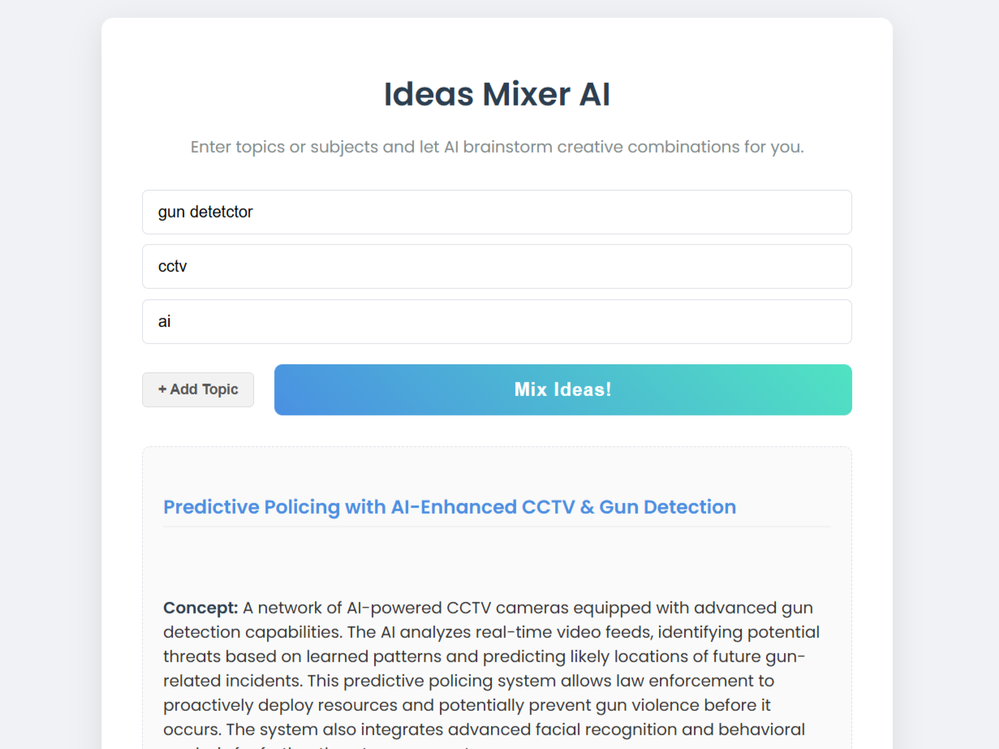

# IdeasMixer
Ideas Mixer AI through Gemini api.
A web tool that generates creative combinations from multiple topics using AI. Enter any subjects (like "Space Exploration" and "Sustainable Farming") and discover innovative mashup ideas.

## Features
- Add unlimited topic fields
- Clean, responsive interface
- AI-powered idea generation
- Simple one-click operation
## How to setup
1. Go to [aistudio](https://aistudio.google.com/)
2. Get your api
3. Enter it when you run code

## How to Use
1. Enter at least 2 topics
2. Click "Mix Ideas!"
3. View your unique combinations

## Technologies
- HTML/CSS/JavaScript
- [Poppins Google Font](https://fonts.google.com/specimen/Poppins)

Developed by [DangerousAngel](https://linktr.ee/DangerousAngel)
